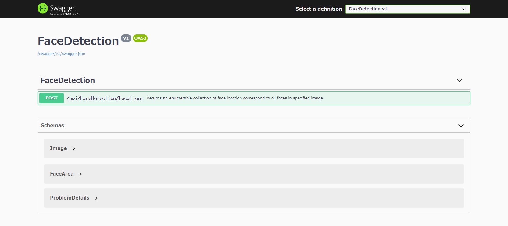

# FaceDetection for ASP.NET
 
This program is sample face detection app for ASP.NET client and server.

## How to run

### Server

````
$ cd FaceDetection.Server
$ dotnet run -c Release -r win-x64

info: Microsoft.Hosting.Lifetime[0]
      Now listening on: http://localhost:5000
info: Microsoft.Hosting.Lifetime[0]
      Now listening on: https://localhost:5001
info: Microsoft.Hosting.Lifetime[0]
      Application started. Press Ctrl+C to shut down.
info: Microsoft.Hosting.Lifetime[0]
      Hosting environment: Development
info: Microsoft.Hosting.Lifetime[0]
      Content root path: D:\Works\OpenSource\DlibDotNet\examples\ASP.NET\FaceDetection.Server
````

You can see **Swagger** by web browser.



### Client

At first, you must download api definitions and generate proxy classes. 
After running FaceDetection.Server, type the following commands.

````
$ cd FaceDetection.Client
$ pwsh UpdateApiDefinition.ps1
````

Then, you can see Server directory.

````
$ pwsh UpdateApiDefinition.ps1
$ dotnet run -c Release -- http://localhost:5000 "2009_004587.jpg"

[Info] Find 2 faces
````

After this, you can see **result.jpg** in current directory.