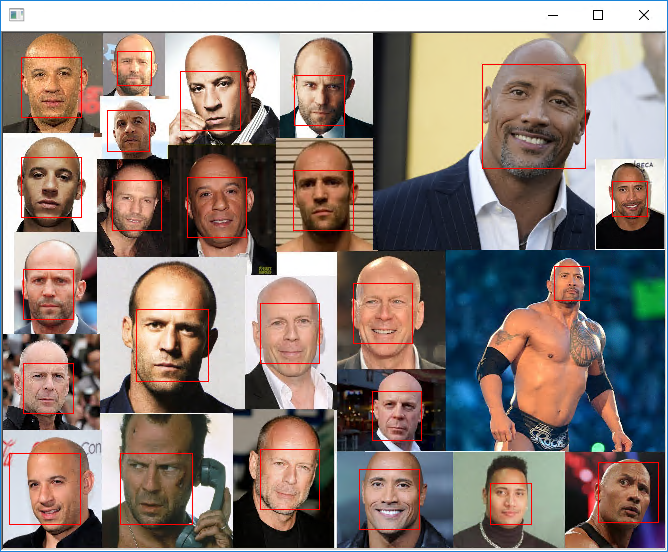
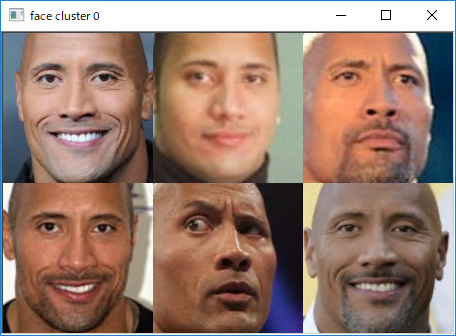
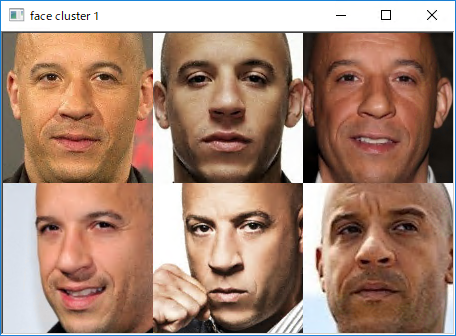
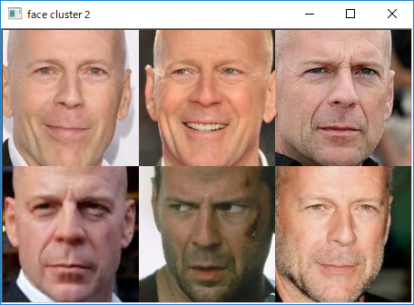

# DNN Face Recognition
 
This program is ported by C# from examples\dnn_face_recognition_ex.cpp.

## How to use?

## 1. Build

1. Open command prompt and change to &lt;DnnFaceRecognition_dir&gt;
1. Type the following command
````
dotnet build -c Release
````
2. Copy ***DlibDotNet.dll***, ***DlibDotNet.Native.dll*** and ***DlibDotNet.Native.Dnn.dll*** to output directory; &lt;DnnFaceRecognition_dir&gt;\bin\Release\netcoreapp2.0.

**NOTE**  
- You should build ***DlibDotNet.Native.dll*** and ***DlibDotNet.Native.Dnn.dll*** with CUDA.
- If you want to run at Linux and MacOS, you should build the **DlibDotNet** at first.  
Please refer the [Tutorial for Linux](https://github.com/takuya-takeuchi/DlibDotNet/wiki/Tutorial-for-Linux) or [Tutorial for MacOS](https://github.com/takuya-takeuchi/DlibDotNet/wiki/Tutorial-for-MacOS).

## 2. Download demo data

Download test data from the following urls.

- http://dlib.net/files/shape_predictor_5_face_landmarks.dat.bz2
- http://dlib.net/files/dlib_face_recognition_resnet_model_v1.dat.bz2
- &lt;dlib&gt;\examples\faces\bald_guys.jpg

And extract them and copy to extracted fiels to &lt;DnnFaceRecognition_dir&gt;.

## 3. Run

````
cd <DnnFaceRecognition_dir>
dotnet run --configuration Release bald_guys.jpg
````









