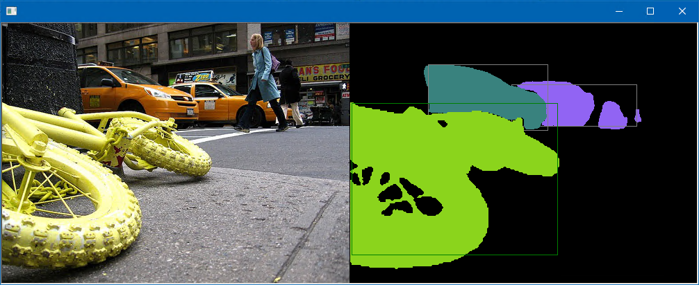
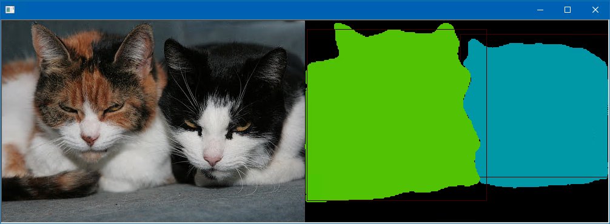

# DNN Instance Segmentation
 
This program is ported by C# from examples\dnn_instance_segmentation_ex.cpp.

## How to use?

## 1. Build

1. Open command prompt and change to &lt;DnnInstanceSegmentation_dir&gt;
1. Type the following command
````
dotnet build -c Release
````
2. Copy ***DlibDotNet.dll***, ***DlibDotNetNative.dll*** and ***DlibDotNetNativeDnn.dll*** to output directory; &lt;DnnInstanceSegmentation_dir&gt;\bin\Release\netcoreapp2.0.

**NOTE**  
- You should build ***DlibDotNetNative.dll*** and ***DlibDotNetNativeDnn.dll*** with CUDA.
- If you want to run at Linux and MacOS, you should build the **DlibDotNet** at first.  
Please refer the [Tutorial for Linux](https://github.com/takuya-takeuchi/DlibDotNet/wiki/Tutorial-for-Linux) or [Tutorial for MacOS](https://github.com/takuya-takeuchi/DlibDotNet/wiki/Tutorial-for-MacOS).

## 2. Download demo data

Download test data from the following urls.

- http://dlib.net/files/instance_segmentation_voc2012net.dnn
- &lt;dlib&gt;\examples\faces\*.jpg

And extract them and copy to extracted files to &lt;DnnInstanceSegmentation_dir&gt;.

## 3. Run

````
cd <DnnInstanceSegmentation_dir>
dotnet run --configuration Release -- D:\VOC2012\JPEGImages
Found 17125 images, processing...
Found car, car, bicycle in 2007_005273.jpg - hit enter to process the next image
Found 1 images, processing...
Found cat, cat in 2007_002760.jpg - hit enter to process the next image
````


