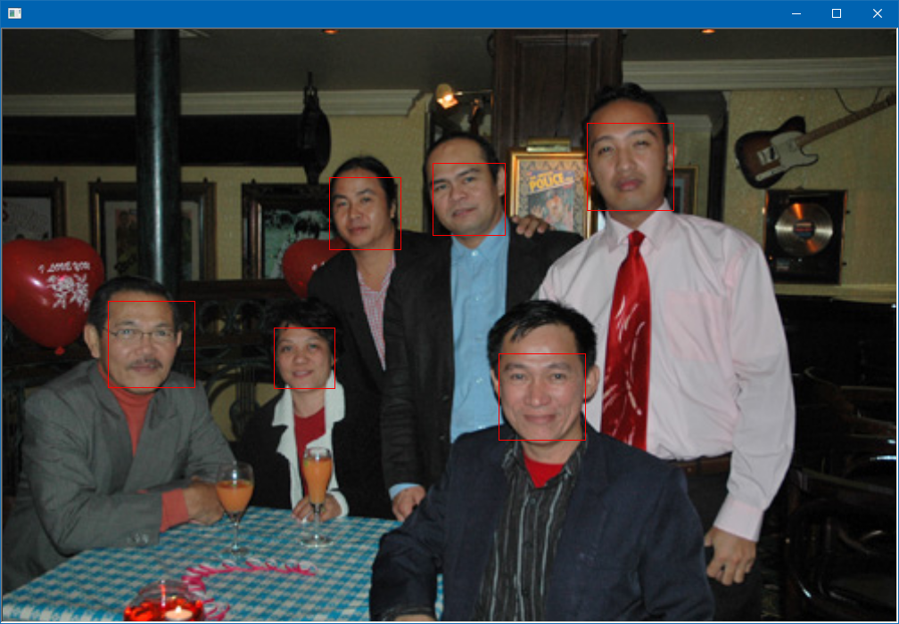
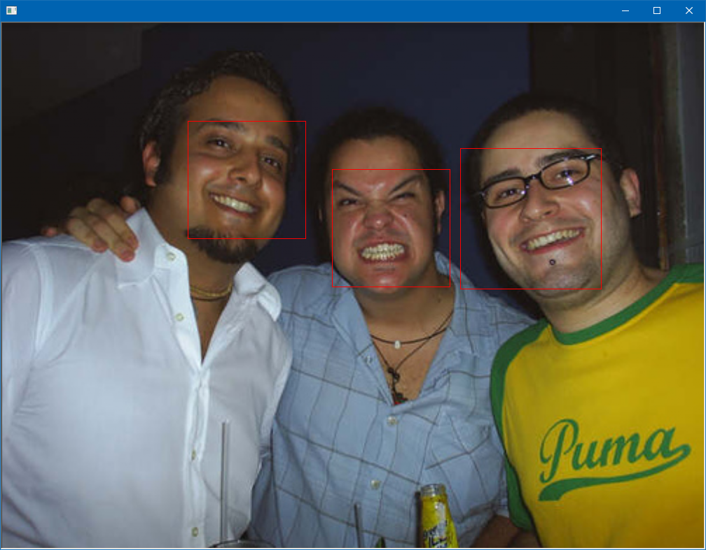
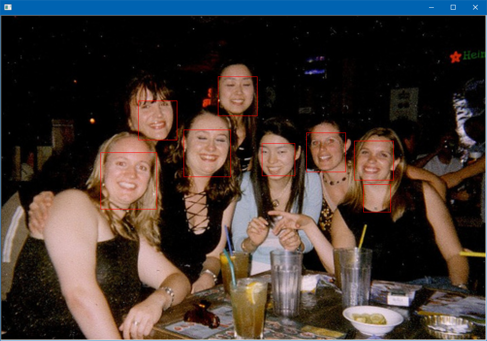
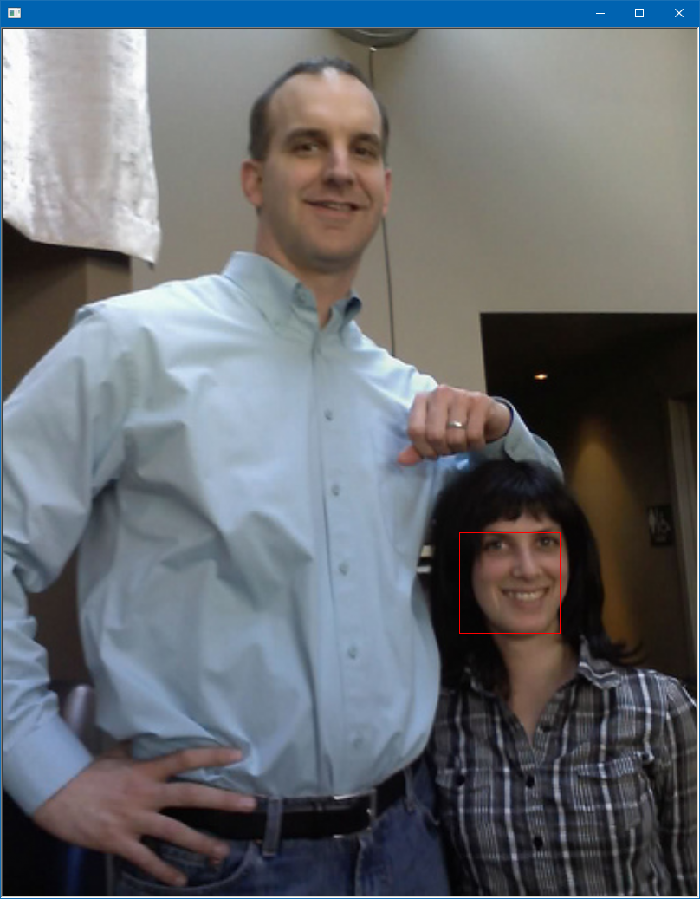

# Dnn Mmod
 
This program is ported by C# from examples\dnn_mmod_ex.cpp.

## How to use?

## 1. Build

1. Open command prompt and change to &lt;DnnMmod_dir&gt;
1. Type the following command
````
dotnet build -c Release
````
2. Copy ***DlibDotNet.dll***, ***DlibDotNetNative.dll*** and ***DlibDotNetNativeDnn.dll*** to output directory; &lt;DnnMmod_dir&gt;\bin\Release\netcoreapp2.0.

**NOTE**  
- You should build ***DlibDotNetNative.dll*** and ***DlibDotNetNativeDnn.dll*** with CUDA.
- If you want to run at Linux and MacOS, you should build the **DlibDotNet** at first.  
Please refer the [Tutorial for Linux](https://github.com/takuya-takeuchi/DlibDotNet/wiki/Tutorial-for-Linux) or [Tutorial for MacOS](https://github.com/takuya-takeuchi/DlibDotNet/wiki/Tutorial-for-MacOS).

And extract them and copy to extracted files to &lt;DnnMmod_dir&gt;.

## 2. Run

````
cd <DnnMmod_dir>
dotnet run -c Release dlib\examples\faces

num training images: 4
num testing images:  5
num detector windows: 1
detector window width by height: 40 x 40
overlap NMS IOU thresh:             0.17035310497002
overlap NMS percent covered thresh: 0.331409811307524
step#: 0     learning rate: 0.1   average loss: 0            steps without apparent progress: 0
step#: 79    learning rate: 0.1   average loss: 8.82643      steps without apparent progress: 4
step#: 168   learning rate: 0.1   average loss: 3.47236      steps without apparent progress: 6
step#: 256   learning rate: 0.1   average loss: 2.57292      steps without apparent progress: 38
step#: 344   learning rate: 0.1   average loss: 2.26006      steps without apparent progress: 4
step#: 431   learning rate: 0.1   average loss: 2.09786      steps without apparent progress: 19
step#: 518   learning rate: 0.1   average loss: 1.98469      steps without apparent progress: 77
step#: 603   learning rate: 0.1   average loss: 1.9057       steps without apparent progress: 67
Saved state to mmod_sync
step#: 686   learning rate: 0.1   average loss: 1.83899      steps without apparent progress: 62
step#: 773   learning rate: 0.1   average loss: 1.7566       steps without apparent progress: 68
step#: 859   learning rate: 0.1   average loss: 1.72206      steps without apparent progress: 84
step#: 946   learning rate: 0.1   average loss: 1.68711      steps without apparent progress: 27
step#: 1032  learning rate: 0.1   average loss: 1.63682      steps without apparent progress: 63
step#: 1118  learning rate: 0.1   average loss: 1.61003      steps without apparent progress: 59
step#: 1205  learning rate: 0.1   average loss: 1.57036      steps without apparent progress: 82
Saved state to mmod_sync_
step#: 1288  learning rate: 0.1   average loss: 1.53538      steps without apparent progress: 71
step#: 1375  learning rate: 0.1   average loss: 1.49588      steps without apparent progress: 33
step#: 1462  learning rate: 0.1   average loss: 1.45791      steps without apparent progress: 39
step#: 1549  learning rate: 0.1   average loss: 1.39962      steps without apparent progress: 46
step#: 1637  learning rate: 0.1   average loss: 1.40381      steps without apparent progress: 143
step#: 1724  learning rate: 0.1   average loss: 1.34838      steps without apparent progress: 25
step#: 1812  learning rate: 0.1   average loss: 1.29983      steps without apparent progress: 61
step#: 1900  learning rate: 0.1   average loss: 1.26096      steps without apparent progress: 118
Saved state to mmod_sync
step#: 1984  learning rate: 0.1   average loss: 1.22488      steps without apparent progress: 50
step#: 2071  learning rate: 0.1   average loss: 1.16277      steps without apparent progress: 66
step#: 2158  learning rate: 0.1   average loss: 1.12516      steps without apparent progress: 7
step#: 2245  learning rate: 0.1   average loss: 1.05639      steps without apparent progress: 3
step#: 2331  learning rate: 0.1   average loss: 0.976981     steps without apparent progress: 11
step#: 2417  learning rate: 0.1   average loss: 0.921116     steps without apparent progress: 57
step#: 2503  learning rate: 0.1   average loss: 0.861175     steps without apparent progress: 83
Saved state to mmod_sync_
step#: 2586  learning rate: 0.1   average loss: 0.809838     steps without apparent progress: 56
step#: 2671  learning rate: 0.1   average loss: 0.751057     steps without apparent progress: 3
step#: 2757  learning rate: 0.1   average loss: 0.706875     steps without apparent progress: 31
step#: 2843  learning rate: 0.1   average loss: 0.656435     steps without apparent progress: 36
step#: 2928  learning rate: 0.1   average loss: 0.598547     steps without apparent progress: 37
step#: 3015  learning rate: 0.1   average loss: 0.544169     steps without apparent progress: 28
step#: 3101  learning rate: 0.1   average loss: 0.489133     steps without apparent progress: 12
step#: 3187  learning rate: 0.1   average loss: 0.446233     steps without apparent progress: 100
Saved state to mmod_sync
step#: 3269  learning rate: 0.1   average loss: 0.40875      steps without apparent progress: 21
step#: 3355  learning rate: 0.1   average loss: 0.364275     steps without apparent progress: 45
step#: 3441  learning rate: 0.1   average loss: 0.325861     steps without apparent progress: 49
step#: 3526  learning rate: 0.1   average loss: 0.295627     steps without apparent progress: 25
step#: 3613  learning rate: 0.1   average loss: 0.271522     steps without apparent progress: 62
step#: 3699  learning rate: 0.1   average loss: 0.241809     steps without apparent progress: 59
step#: 3785  learning rate: 0.1   average loss: 0.218258     steps without apparent progress: 28
Saved state to mmod_sync_
step#: 3869  learning rate: 0.1   average loss: 0.209427     steps without apparent progress: 140
step#: 3956  learning rate: 0.1   average loss: 0.190739     steps without apparent progress: 30
step#: 4042  learning rate: 0.1   average loss: 0.181388     steps without apparent progress: 123
step#: 4127  learning rate: 0.1   average loss: 0.179546     steps without apparent progress: 202
step#: 4212  learning rate: 0.1   average loss: 0.157758     steps without apparent progress: 35
step#: 4298  learning rate: 0.1   average loss: 0.145927     steps without apparent progress: 125
step#: 4384  learning rate: 0.1   average loss: 0.142759     steps without apparent progress: 94
step#: 4471  learning rate: 0.1   average loss: 0.131786     steps without apparent progress: 51
Saved state to mmod_sync
step#: 4554  learning rate: 0.1   average loss: 0.138609     steps without apparent progress: 226
step#: 4640  learning rate: 0.1   average loss: 0.124859     steps without apparent progress: 38
step#: 4727  learning rate: 0.1   average loss: 0.114648     steps without apparent progress: 76
step#: 4812  learning rate: 0.1   average loss: 0.117145     steps without apparent progress: 181
step#: 4897  learning rate: 0.1   average loss: 0.112281     steps without apparent progress: 36
step#: 4983  learning rate: 0.1   average loss: 0.103165     steps without apparent progress: 13
step#: 5069  learning rate: 0.1   average loss: 0.108017     steps without apparent progress: 216
Saved state to mmod_sync_
step#: 5152  learning rate: 0.1   average loss: 0.0995669    steps without apparent progress: 89
step#: 5238  learning rate: 0.1   average loss: 0.0970639    steps without apparent progress: 128
step#: 5324  learning rate: 0.1   average loss: 0.0948572    steps without apparent progress: 10
step#: 5410  learning rate: 0.1   average loss: 0.0944506    steps without apparent progress: 162
step#: 5495  learning rate: 0.1   average loss: 0.089011     steps without apparent progress: 47
step#: 5579  learning rate: 0.1   average loss: 0.0906266    steps without apparent progress: 186
step#: 5663  learning rate: 0.1   average loss: 0.0817111    steps without apparent progress: 93
step#: 5748  learning rate: 0.1   average loss: 0.0841296    steps without apparent progress: 180
Saved state to mmod_sync
step#: 5830  learning rate: 0.1   average loss: 0.0810282    steps without apparent progress: 248
step#: 5915  learning rate: 0.1   average loss: 0.0808368    steps without apparent progress: 155
step#: 5999  learning rate: 0.1   average loss: 0.0780074    steps without apparent progress: 55
step#: 6084  learning rate: 0.1   average loss: 0.0731256    steps without apparent progress: 140
step#: 6170  learning rate: 0.1   average loss: 0.06788      steps without apparent progress: 72
step#: 6254  learning rate: 0.1   average loss: 0.0708416    steps without apparent progress: 222
step#: 6339  learning rate: 0.01  average loss: 0.0753411    steps without apparent progress: 3
Saved state to mmod_sync_
step#: 6420  learning rate: 0.01  average loss: 0.050215     steps without apparent progress: 64
step#: 6504  learning rate: 0.01  average loss: 0.0440317    steps without apparent progress: 26
step#: 6589  learning rate: 0.01  average loss: 0.0405475    steps without apparent progress: 73
step#: 6673  learning rate: 0.01  average loss: 0.0407321    steps without apparent progress: 157
step#: 6759  learning rate: 0.01  average loss: 0.0409794    steps without apparent progress: 283
step#: 6844  learning rate: 0.001  average loss: 0.0418813    steps without apparent progress: 70
step#: 6929  learning rate: 0.001  average loss: 0.0364316    steps without apparent progress: 80
step#: 7014  learning rate: 0.001  average loss: 0.0361881    steps without apparent progress: 154
Saved state to mmod_sync
step#: 7097  learning rate: 0.001  average loss: 0.0341821    steps without apparent progress: 137
step#: 7181  learning rate: 0.0001  average loss: 0.0364272    steps without apparent progress: 16
step#: 7265  learning rate: 0.0001  average loss: 0.0387988    steps without apparent progress: 102
step#: 7350  learning rate: 0.0001  average loss: 0.0373047    steps without apparent progress: 186
step#: 7435  learning rate: 0.0001  average loss: 0.0365116    steps without apparent progress: 180
step#: 7520  learning rate: 0.0001  average loss: 0.0374175    steps without apparent progress: 266
Saved state to mmod_sync_
done training
training results: 1 1 1

testing results:    1 0.8 0.8

dnn_trainer details:
  net_type::num_layers:  21
  net size: 0.32133MB
  net architecture hash: 7600b2f14c44f774423f3fa1ecd5ae00
  loss: loss_mmod        (detector_windows:(40x40), loss per FA:1, loss per miss:1, truth match IOU thresh:0.5, use_bounding_box_regression:0, overlaps_nms:(0.170353,0.33141), overlaps_ignore:(0.5,1))
  synchronization file:                       mmod_sync
  trainer.get_solvers()[0]:                   sgd: weight_decay=0.0005, momentum=0.9
  learning rate:                              1e-05
  learning rate shrink factor:                0.1
  min learning rate:                          1e-05
  iterations without progress threshold:      300
  test iterations without progress threshold: 500
random_cropper details:
  chip_dims.rows:              200
  chip_dims.cols:              200
  randomly_flip:               true
  max_rotation_degrees:        30
  min_object_length_long_dim:  40
  min_object_length_short_dim: 40
  max_object_size:             0.7
  background_crops_fraction:   0.5
  translate_amount:            0.1
````





