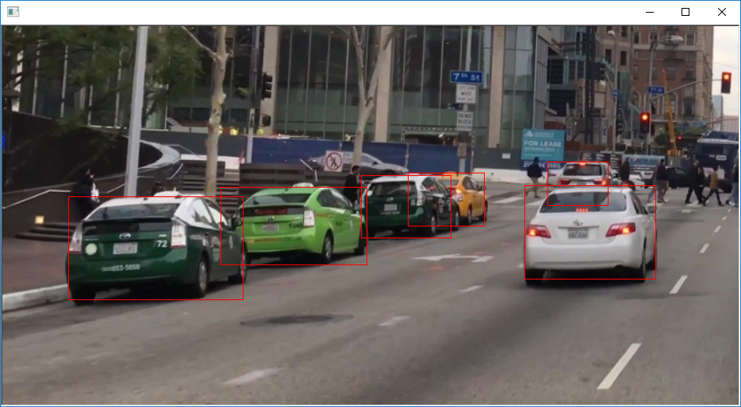
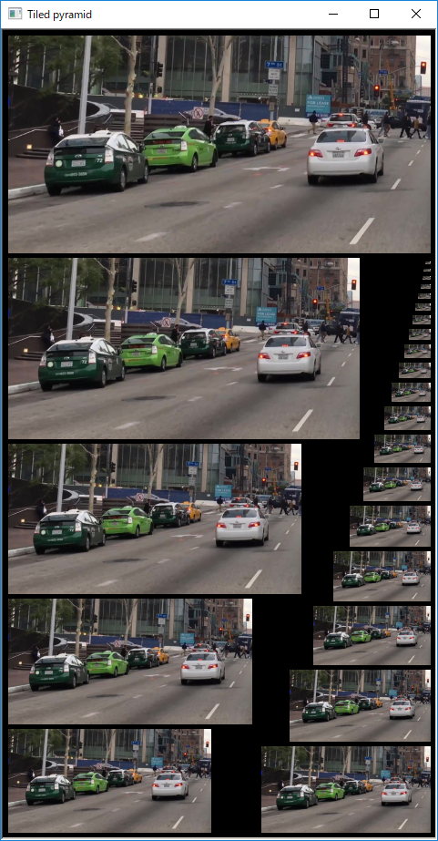
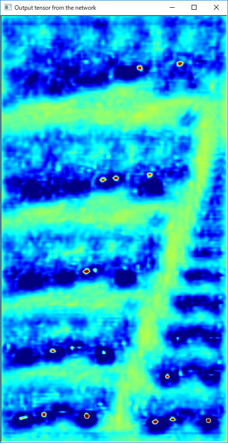
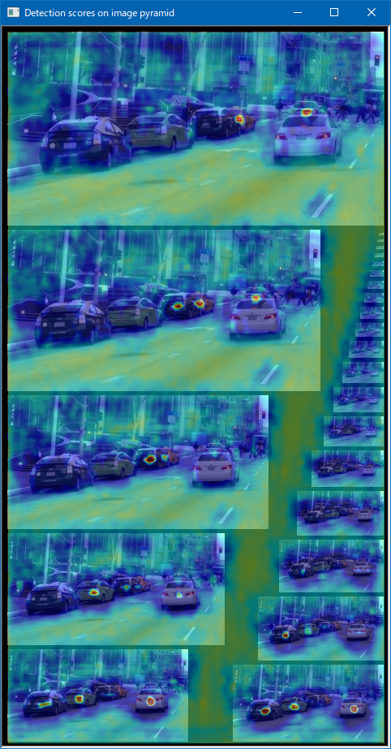
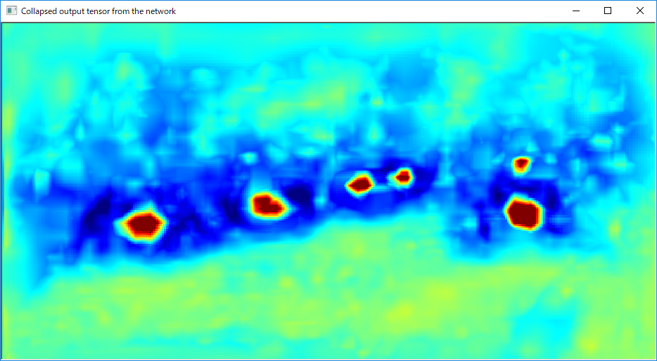
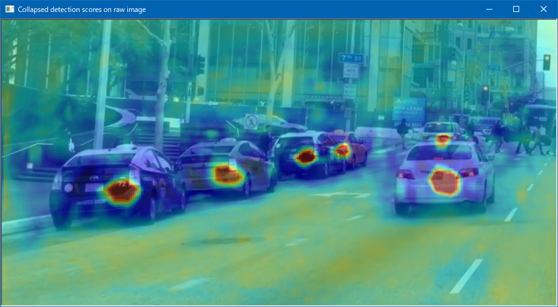

# Dnn Mmod Find Cars
 
This program is ported by C# from examples\dnn_mmod_find_cars_ex.cpp.

## How to use?

## 1. Build

1. Open command prompt and change to &lt;DnnMmodFindCars_dir&gt;
1. Type the following command
````
dotnet build -c Release
````
2. Copy ***DlibDotNet.dll***, ***DlibDotNetNative.dll*** and ***DlibDotNetNativeDnn.dll*** to output directory; &lt;DnnMmodFindCars_dir&gt;\bin\Release\netcoreapp2.0.

**NOTE**  
- You should build ***DlibDotNetNative.dll*** and ***DlibDotNetNativeDnn.dll*** with CUDA.
- If you want to run at Linux and MacOS, you should build the **DlibDotNet** at first.  
Please refer the [Tutorial for Linux](https://github.com/takuya-takeuchi/DlibDotNet/wiki/Tutorial-for-Linux) or [Tutorial for MacOS](https://github.com/takuya-takeuchi/DlibDotNet/wiki/Tutorial-for-MacOS).

## 2. Download demo data

Download test data from the following urls.

- http://dlib.net/files/mmod_rear_end_vehicle_detector.dat.bz2
- &lt;dlib&gt;\examples\mmod_cars_test_image.jpg

And extract them and copy to extracted files to &lt;DnnMmodFindCars_dir&gt;.

## 3. Run

````
cd <DnnMmodFindCars_dir>
dotnet run -c Release

Hit enter to view the intermediate processing steps
jet color mapping range:  lower=-2.5  upper=0
Number of channels in final tensor image: 3
Hit enter to end program
````






