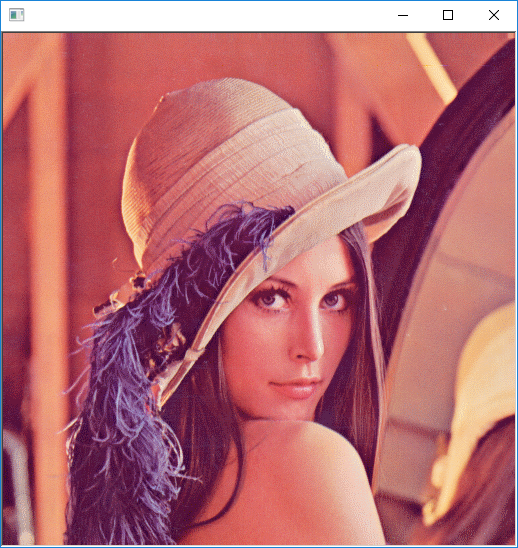
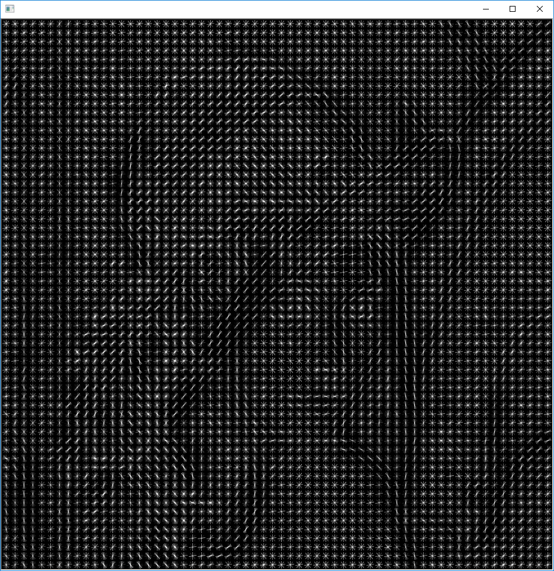

# FHog
 
This program is ported by C# from examples\fhog_ex.cpp.

## How to use?

## 1. Build

1. Open command prompt and change to &lt;FHog_dir&gt;
1. Type the following command
````
dotnet build -c Release
````
2. Copy ***DlibDotNet.dll***, ***DlibDotNetNative.dll*** and ***DlibDotNetNativeDnn.dll*** to output directory; &lt;FHog_dir&gt;\bin\Release\netcoreapp2.0.

**NOTE**  
- You should build ***DlibDotNetNative.dll*** and ***DlibDotNetNativeDnn.dll*** with CUDA.
- If you want to run at Linux and MacOS, you should build the **DlibDotNet** at first.  
Please refer the [Tutorial for Linux](https://github.com/takuya-takeuchi/DlibDotNet/wiki/Tutorial-for-Linux) or [Tutorial for MacOS](https://github.com/takuya-takeuchi/DlibDotNet/wiki/Tutorial-for-MacOS).

## 2. Download demo data

You can use any BMP data. 

## 3. Run

````
cd <FHog_dir>
dotnet run -c Release <DlibDotNet\test\DlibDotNet.Tests\data\Lenna.bmp>

hog image has 62 rows and 62 columns.
````


