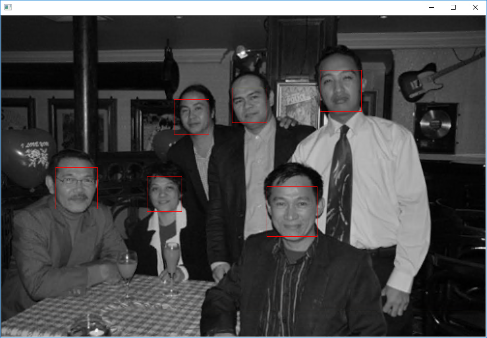
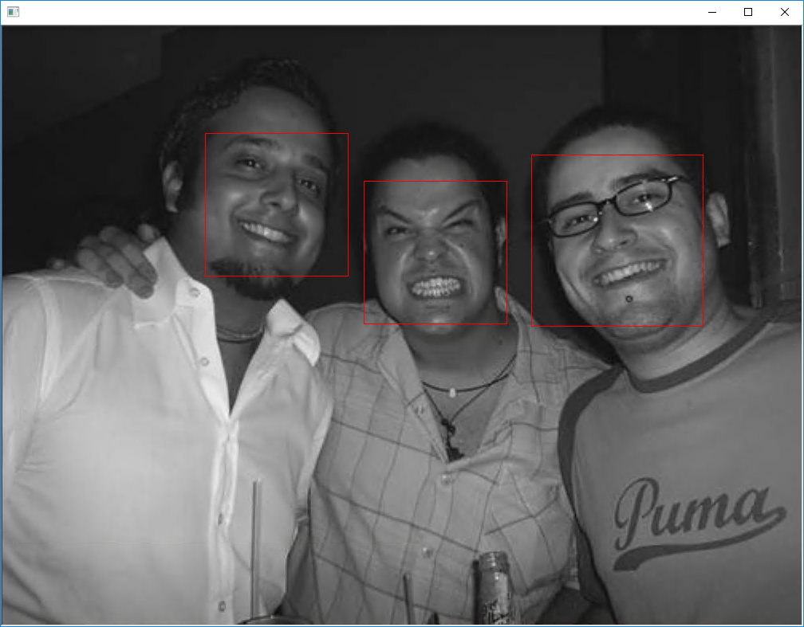
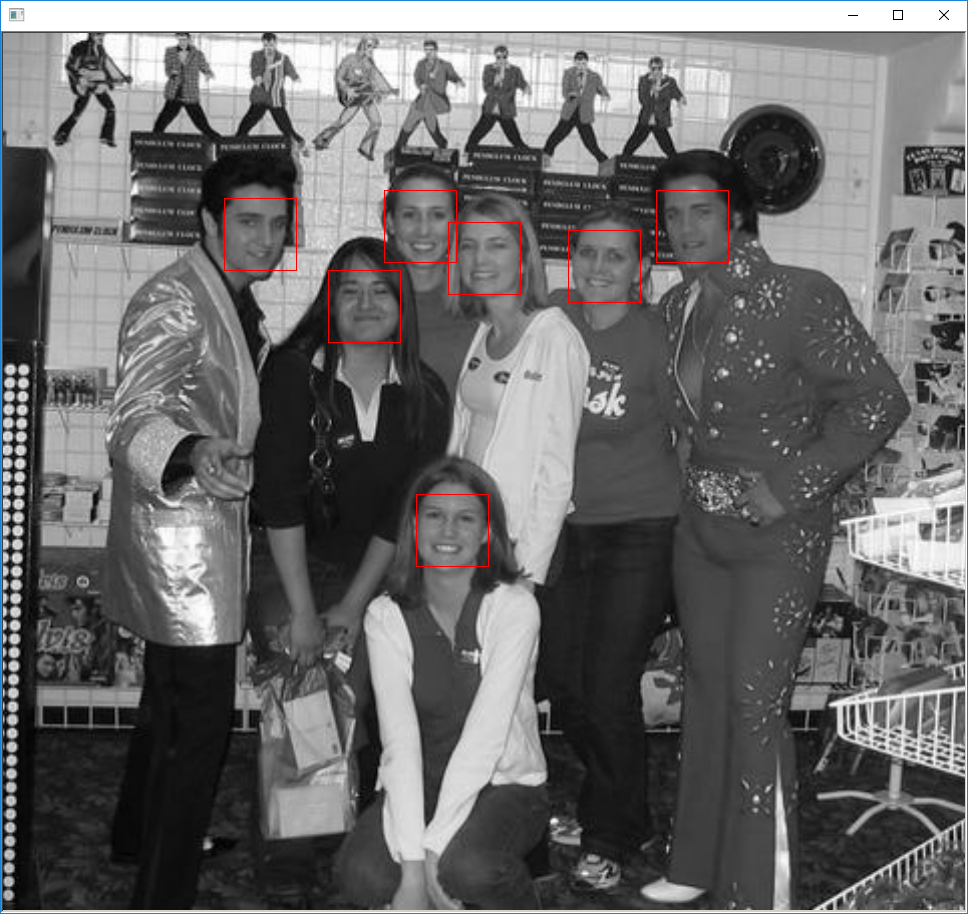
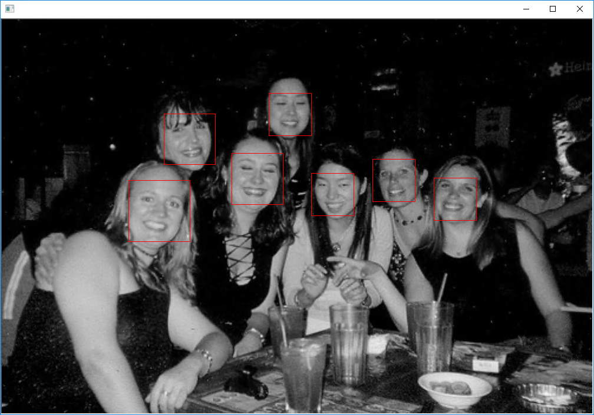
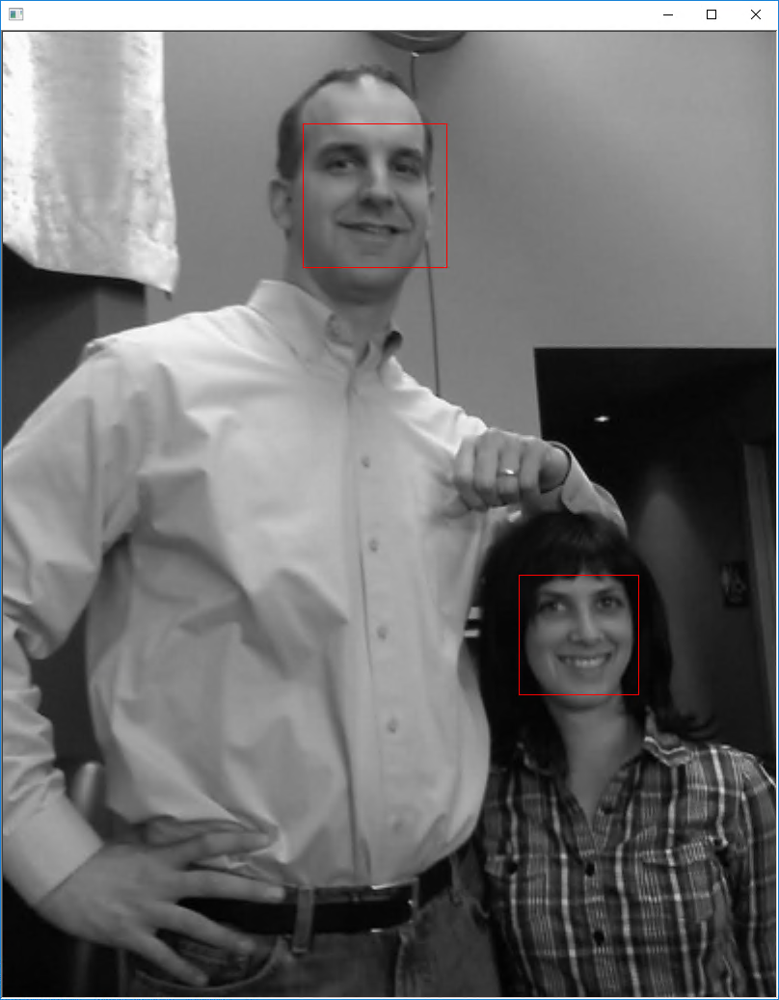

# FHog Object Detector
 
This program is ported by C# from examples\fhog_object_detector_ex.cpp.

## How to use?

## 1. Build

1. Open command prompt and change to &lt;FHogObjectDetector_dir&gt;
1. Type the following command
````
dotnet build -c Release
````
2. Copy ***DlibDotNet.dll***, ***DlibDotNet.Native.dll*** and ***DlibDotNet.Native.Dnn.dll*** to output directory; &lt;FHogObjectDetector_dir&gt;\bin\Release\netcoreapp2.0.

**NOTE**  
- You should build ***DlibDotNet.Native.dll*** and ***DlibDotNet.Native.Dnn.dll*** with CUDA.
- If you want to run at Linux and MacOS, you should build the **DlibDotNet** at first.  
Please refer the [Tutorial for Linux](https://github.com/takuya-takeuchi/DlibDotNet/wiki/Tutorial-for-Linux) or [Tutorial for MacOS](https://github.com/takuya-takeuchi/DlibDotNet/wiki/Tutorial-for-MacOS).

## 2. Download demo data

Download test data from the following urls.

- &lt;dlib&gt;\examples\faces\*.jpg

And extract them and copy to extracted files to &lt;FHogObjectDetector_dir&gt;.

## 3. Run

````
cd <FHogObjectDetector_dir>
dotnet run -c Release <examples\faces>

num training images: 8
num testing images:  5
objective:     61.3303
objective gap: 61.326
risk:          61.326
risk gap:      61.326
num planes:    3
iter:          1

...

objective:     17.896
objective gap: 17.7231
risk:          17.7235
risk gap:      17.7231
num planes:    4
iter:          2
objective:     1.87572
objective gap: 0.0093149
risk:          0.017506
risk gap:      0.0093149
num planes:    123
iter:          264

objective:     1.87521
objective gap: 0.00880015
risk:          0.0171305
risk gap:      0.00880015
num planes:    121
iter:          265

objective:     1.87538
objective gap: 0.00896044
risk:          0.0174401
risk gap:      0.00896044
num planes:    120
iter:          266

training results: 1 1 1

testing results: 1 1 1
````






