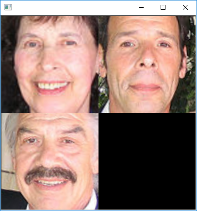

# Face Landmark Detection
 
This program is ported by C# from examples\face_landmark_detection.cpp.

## How to use?

## 1. Build

1. Open command prompt and change to &lt;FaceLandmarkDetection_dir&gt;
1. Type the following command
````
dotnet build -c Release
````
2. Copy ***DlibDotNet.dll***, ***DlibDotNet.Native.dll*** and ***DlibDotNet.Native.Dnn.dll*** to output directory; &lt;FaceLandmarkDetection_dir&gt;\bin\Release\netcoreapp2.0.

**NOTE**  
- You should build ***DlibDotNet.Native.dll*** and ***DlibDotNet.Native.Dnn.dll*** with CUDA.
- If you want to run at Linux and MacOS, you should build the **DlibDotNet** at first.  
Please refer the [Tutorial for Linux](https://github.com/takuya-takeuchi/DlibDotNet/wiki/Tutorial-for-Linux) or [Tutorial for MacOS](https://github.com/takuya-takeuchi/DlibDotNet/wiki/Tutorial-for-MacOS).

## 2. Download demo data

Download test data from the following urls.

- http://dlib.net/files/shape_predictor_68_face_landmarks.dat.bz2
- &lt;dlib&gt;\examples\faces\*.jpg

And extract them and copy to extracted fiels to &lt;FaceLandmarkDetection_dir&gt;.

## 3. Run

````
cd <FaceLandmarkDetection_dir>
dotnet run -c Release shape_predictor_68_face_landmarks.dat <dlib\examples\faces\2008_001322.jpg>

processing image 2008_001322.jpg
Number of faces detected: 3
number of parts: 68
pixel position of first part:  (468, 472)
pixel position of second part: (468, 488)
number of parts: 68
pixel position of first part:  (212, 367)
pixel position of second part: (211, 386)
number of parts: 68
pixel position of first part:  (711, 397)
pixel position of second part: (713, 417)
hit enter to process next frame
````


