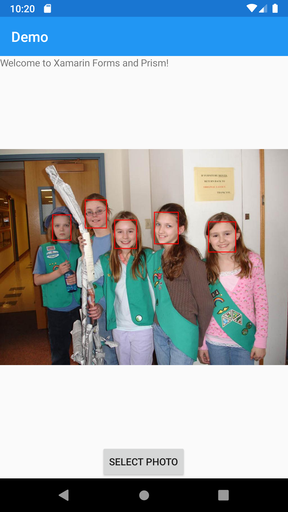
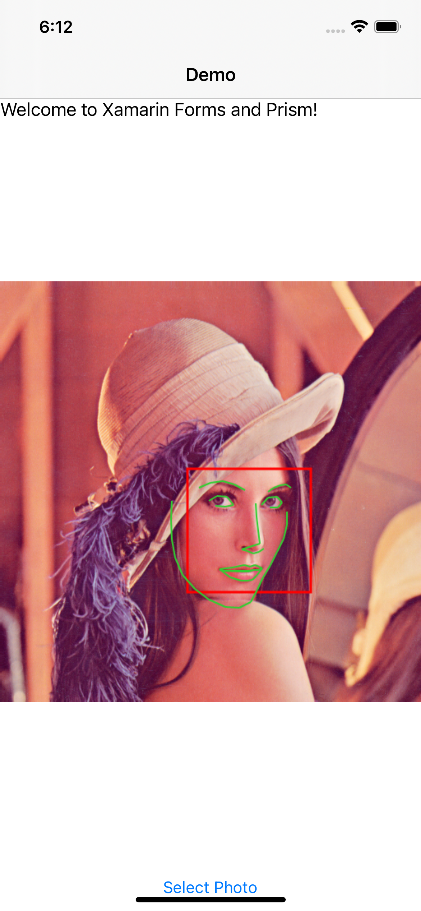
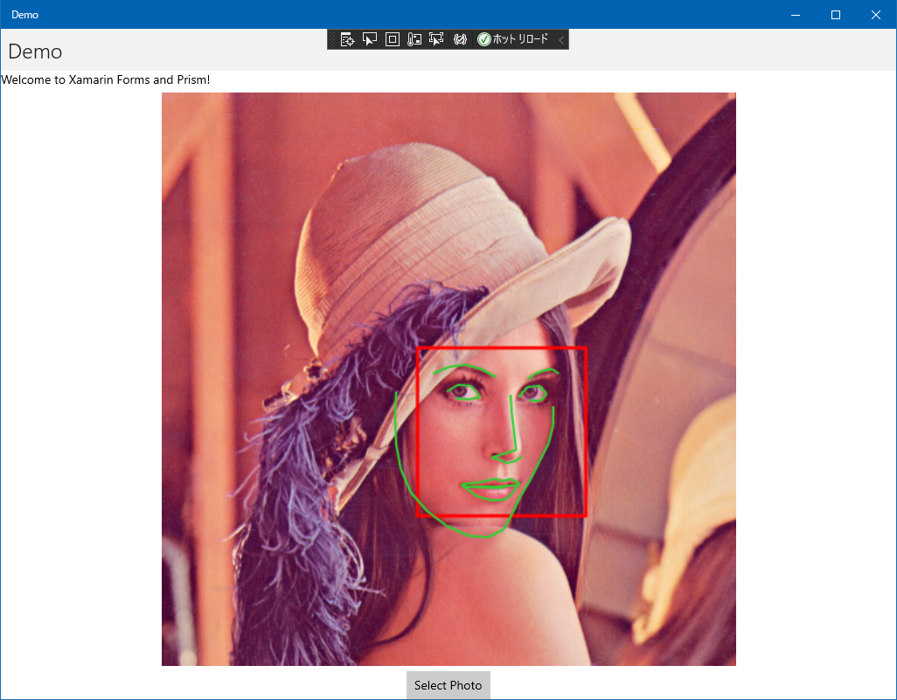

# Xamarin.Demo
  
This program is demonstration to detect face on Xamarin. 
 
## How to use? 
 
## 1. Build 
 
1. Open solution file by Visual Studio with Xamarin.
1. Restore nuget package
1. Buuild 

## 2. Download demo data

Download test data from the following urls.

- https://github.com/Linzaer/Ultra-Light-Fast-Generic-Face-Detector-1MB/tree/master/ncnn/data
  - version-RFB/RFB-320.bin
  - version-RFB/RFB-320.param

And extract them and copy to examples/Xamarin/Demo/Demo/data.
 
## 3. Run 

You can build and run from `Visual Studio for Mac`
You can choose a image file to detect objects.

 

